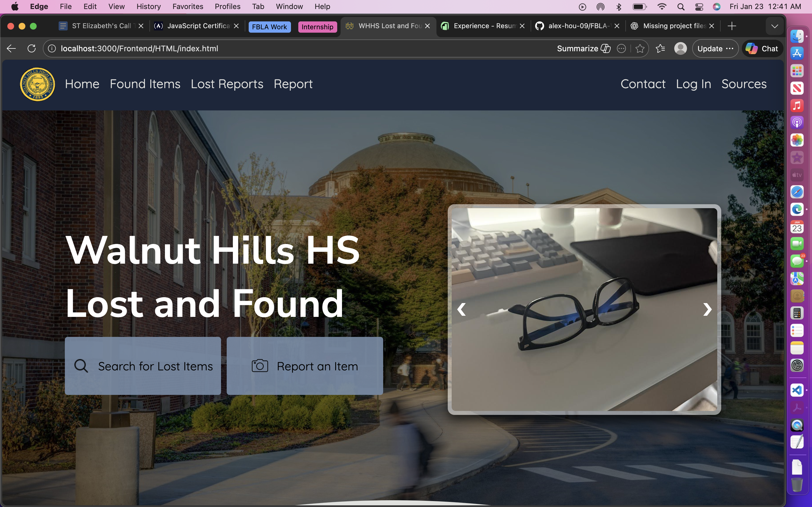

# FBLA Lost and Found Website Project


This is my student project created for the **FBLA Website Coding and Development** event. It simulates the Walnut Hills High School Lost and Found system where users can report lost items, claim found items, and manage a simple credits system for engagement. This project serves to digitize and streamline the entire lost and found system, which helps to enhance the lost item process. 

Note: the frontend is built off my previous project displaying the computer science classes at my school. This was in order for me to focus on project-based learning of backend development as it enabled me to spend more time working with APIs and JSON files.

---

##  Features

- **Item Reporting**: Users can submit lost or found items with descriptions, locations, and dates.  
- **Claims Management**: Track claims for lost items submitted by users.  
- **Credits System**: Students earn credits for returning items, redeemable in a virtual rewards shop.  
- **Responsive Frontend**: User-friendly interface for reporting and viewing items.  
- **Backend Server**: Node.js/Express handles API requests and stores project data.  

---

##  Folder Structure

```
FBLA-Website-Coding-and-Development-2026/
├── Data/               # JSON files storing users, items, claims, etc.
├── Frontend/
│   ├── HTML/           # All HTML pages
│   ├── Images/         # Images used in the site
│   └── External/
│       ├── CSS/        # All CSS files
│       └── JS/         # All JavaScript files
├── .gitignore          # Files and folders Git should ignore  
├── package.json        # Project configuration and dependencies
├── package-lock.json   # Auto-generated dependency tree
├── server.js           # Node.js/Express backend
└── README.md           # This documentation

```

---

##  Getting Started

### Prerequisites

- Node.js (v14+ recommended)  
- npm (comes with Node.js)  
- Git (for version control)  

### Installation

1. Clone the repository:  
```bash
git clone https://github.com/alex-hou-09/FBLA-Website-Coding-and-Development-2026.git
```

2. Navigate into the project folder:  
```bash
cd FBLA-Website-Coding-and-Development-2026
```

3. Install dependencies:  
```bash
npm install
```

4. Start the server:  
```bash
node server.js
```

5. Open a browser and go to:  
```
http://localhost:3000
```

---

##  Screenshots

  
  

---

##  Credits System

- Students earn credits for returning found items.  
- Credits can be redeemed for virtual rewards like candy, tickets, or other incentives (demonstration purposes for FBLA event).  

---


##  License

This project is created for educational purposes and FBLA competition submission.
